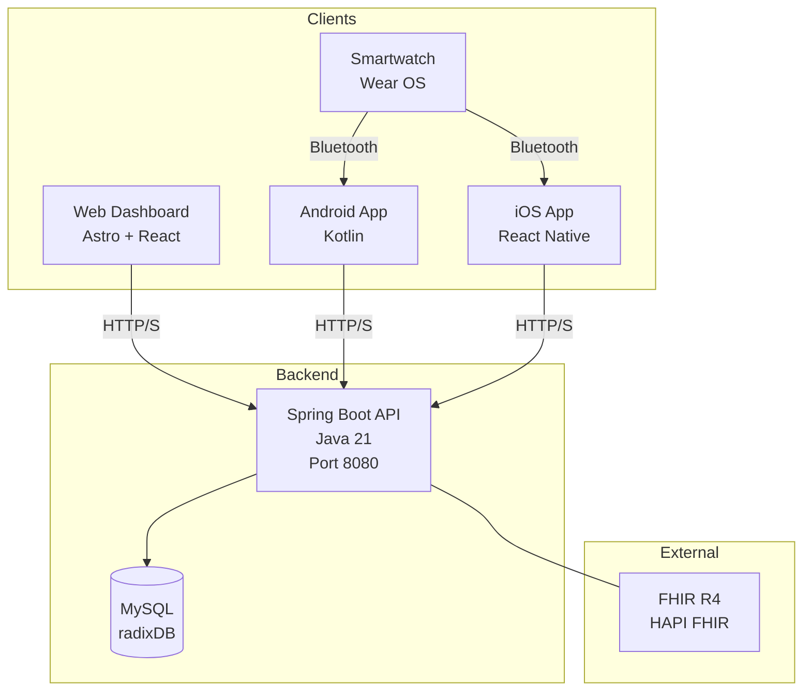

# Arquitectura del Sistema

## Visión General

Radix es un ecosistema de monitoreo médico para pacientes de medicina nuclear. Utiliza un arquitectura distribuida con múltiples clientes que consumen un API centralizado.

## Diagrama de Arquitectura



## Componentes

### Backend (radix-api)

- **Tecnología**: Spring Boot 3.5.9, Java 21, Maven
- **Base de datos**: MySQL (producción), H2 (desarrollo)
- **ORM**: JPA/Hibernate con `ddl-auto: update`
- **Puerto**: 8080
- **Context Path**: `/v1`

**Ubicación**: `radix-api/`

### Frontend Web (radix-web)

- **Tecnología**: Astro 5.18 (SSR mode), React 19, Tailwind CSS
- **Server**: Node adapter (standalone)
- **Puerto**: 4321 (dev)
- **URL Prod**: `https://raddix.pro`

**Ubicación**: `radix-web/`

### Android App (radix_app)

- **Tecnología**: Kotlin, Jetpack Compose, Gradle 9.3
- **Min SDK**: 24 (Android 7.0)
- **Target SDK**: 36
- **API**: Retrofit + OkHttp
- **Puerto local**: 8080 (para desarrollo)

**Ubicación**: `radix_app/`

### iOS App (radix-ios)

- **Tecnología**: Expo SDK 52, React Native 0.76, TypeScript
- **Routing**: Expo Router (file-based)
- **Auth**: SecureStore
- **Puerto local**: 8080 (para desarrollo)

**Ubicación**: `radix-ios/`

### Smartwatch App (radix_reloj)

- **Tecnología**: Kotlin, Wear OS, Jetpack Compose
- **Min SDK**: 30 (Android 11)
- **Sensores**: Heart rate, Steps (Health Services)
- **Comunicación**: Bluetooth con Android/iOS

**Ubicación**: `radix_reloj/`

## Comunicación entre Componentes

### API REST (Backend)

Todos los clientes se comunican con el backend via REST API:

| Cliente | Base URL | API Version |
|---------|----------|-------------|
| Web | `https://api.raddix.pro` | `/v1` |
| Android | `https://api.raddix.pro` | `/v2` |
| iOS | `http://localhost:8080/v2` | `/v2` |

### Endpoints Principales

- `POST /api/auth/login` - Autenticación
- `POST /api/auth/register/*` - Registro
- `GET /api/patients` - Listar pacientes
- `GET /api/users` - Listar usuarios
- `GET /actuator/health` - Health check

## Modelo de Datos

El backend define el modelo de datos como entidades JPA:

```
User (1) ─────< Patient (N)
User (1) ─────< Treatment (N)
Patient (1) ──< Smartwatch (N)
Patient (1) ──< HealthMetrics (N)
Patient (1) ──< HealthLog (N)
Patient (1) ──< RadiationLog (N)
Patient (1) ──< DoctorAlert (N)
Patient (1) ──< GameSession (N)
Patient (1) ──< Settings (1)
Treatment (1) ─< DoctorAlert (N)
Treatment (1) ─< RadiationLog (N)
```

## Autenticación y Autorización

### Modelo de Token

El sistema usa un modelo de token simplificado:
- El token es el ID del usuario (mock)
- El backend histórico conserva compatibilidad con `admin-hardcoded-token`,
  pero el frontend ya no crea sesiones hardcoded; usa login real y la cookie
  `radix-user`.

### Roles

| Rol | Permisos |
|-----|----------|
| ADMIN | Crear doctores |
| DOCTOR | Registrar pacientes |
| PATIENT | Acceso a app móviles |

## Integración FHIR

El backend incluye HAPI FHIR v7.4.2 para interoperabilidad con sistemas de salud que usen el estándar FHIR R4.

## Deployment

### Backend
- Dockerfile multi-stage (eclipse-temurin:21)
- Desplegado en Dokploy
- Health check configurado

### Frontend
- Dockerfile con Bun builder + Node 22
- Desplegado en Vercel

### Android
- Build APK via Gradle
- Distribución manual o Firebase App Distribution

### iOS
- Build via Expo
- Distribución via TestFlight o App Store

## Ver También

- [[Backend/API-Overview]] - Documentación del API
- [[Backend/Database-Schema]] - Modelo de datos
- [[Frontend/Frontend-Overview]] - Frontend web
- [[Movil/Android-Overview]] - App Android
- [[Movil/iOS-Overview]] - App iOS
- [[Reloj/Reloj-Overview]] - App smartwatch
