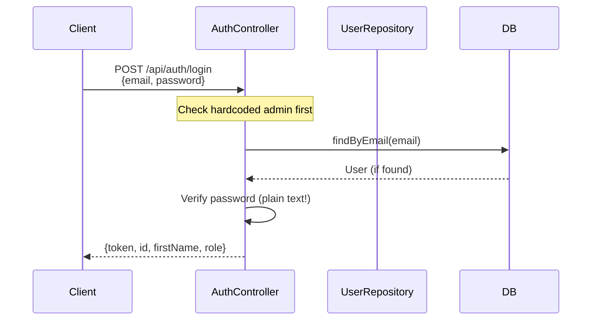

# API Deep Dive - Authentication Flow

## Arquitectura de Autenticación

El sistema de autenticación de Radix usa un modelo simplificado basado en tokens mock. No usa JWT ni OAuth - el "token" es simplemente el ID del usuario.

---

## Admin Hardcoded

El sistema tiene un admin hardcoded para acceso inicial:

```java
// AuthController.java:38
if ("Radix".equals(email) && "radixelmejor1".equals(password)) {
    return ResponseEntity.ok(Map.of(
            "token", "admin-hardcoded-token",
            "id", 0,
            "firstName", "Radix",
            "role", "ADMIN"
    ));
}
```

| Campo | Valor |
|-------|-------|
| Email | `Radix` |
| Password | `radixelmejor1` |
| Token | `admin-hardcoded-token` |
| ID | `0` |
| Rol | `ADMIN` |

---

## Login Flow



### Endpoint

```java
@PostMapping("/login")
public ResponseEntity<?> login(@RequestBody Map<String, String> body) {
    String email = body.get("email");
    String password = body.get("password");

    if (email == null || password == null) {
        return ResponseEntity.status(400)
            .body(Map.of("error", "Email and password are required"));
    }

    // 1. Check hardcoded admin
    if ("Radix".equals(email) && "radixelmejor1".equals(password)) {
        return ResponseEntity.ok(Map.of(
            "token", "admin-hardcoded-token",
            "id", 0,
            "firstName", "Radix",
            "role", "ADMIN"
        ));
    }

    // 2. Check database users
    Optional<User> user = userRepository.findByEmail(email);

    if (user.isEmpty() || !user.get().getPassword().equals(password)) {
        return ResponseEntity.status(401)
            .body(Map.of("error", "Invalid credentials"));
    }

    User u = user.get();
    return ResponseEntity.ok(Map.of(
        "token", u.getId(),  // Token = User ID (mock!)
        "id", u.getId(),
        "firstName", u.getFirstName(),
        "role", u.getRole()
    ));
}
```

### Respuestas

| Código | Condición | Respuesta |
|--------|-----------|-----------|
| 200 | Login exitoso | `{token, id, firstName, role}` |
| 400 | Campos faltantes | `{error: "Email and password are required"}` |
| 401 | Credenciales inválidas | `{error: "Invalid credentials"}` |

---

## Registro de Doctores (Admin Only)

```java
@PostMapping("/register/doctor")
public ResponseEntity<?> registerDoctor(
        @RequestHeader("Authorization") String creatorAuth,
        @RequestBody RegisterRequest request) {

    // 1. Validate creator is ADMIN
    Optional<User> creatorOpt = resolveTokenUser(creatorAuth);
    if (creatorOpt.isEmpty() || !"ADMIN".equalsIgnoreCase(creatorOpt.get().getRole())) {
        return ResponseEntity.status(403)
            .body(Map.of("error", "Only Admin can create Doctors"));
    }

    // 2. Validate required fields
    if (request.getFirstName() == null || request.getLastName() == null ||
        request.getEmail() == null || request.getPassword() == null) {
        return ResponseEntity.status(400)
            .body(Map.of("error", "Fields firstName, lastName, email, and password are required"));
    }

    // 3. Check email uniqueness
    if (userRepository.existsByEmail(request.getEmail())) {
        return ResponseEntity.status(400)
            .body(Map.of("error", "Email already exists"));
    }

    // 4. Create doctor user
    User doctor = new User();
    doctor.setFirstName(request.getFirstName());
    doctor.setLastName(request.getLastName());
    doctor.setEmail(request.getEmail());
    doctor.setPassword(request.getPassword());
    doctor.setRole("DOCTOR");
    userRepository.save(doctor);

    return ResponseEntity.ok(Map.of(
        "message", "Doctor user created successfully",
        "id", doctor.getId()
    ));
}
```

### Registro de Pacientes (Doctor Only)

```java
@PostMapping("/register/patient")
public ResponseEntity<?> registerPatient(
        @RequestHeader("Authorization") String creatorAuth,
        @RequestBody RegisterRequest request) {

    // 1. Validate creator is DOCTOR
    Optional<User> creatorOpt = resolveTokenUser(creatorAuth);
    if (creatorOpt.isEmpty() || !"DOCTOR".equalsIgnoreCase(creatorOpt.get().getRole())) {
        return ResponseEntity.status(403)
            .body(Map.of("error", "Only a Doctor can register Patients"));
    }

    // ... validation ...

    // 2. Create Patient User account
    User patientUser = new User();
    patientUser.setFirstName(request.getFirstName());
    patientUser.setLastName(request.getLastName());
    patientUser.setEmail(request.getEmail());
    patientUser.setPassword(request.getPassword());
    patientUser.setRole("PATIENT");
    patientUser = userRepository.save(patientUser);

    // 3. Create Patient record
    Patient patientRecord = new Patient();
    patientRecord.setFullName(request.getFirstName() + " " + request.getLastName());
    patientRecord.setPhone(request.getPhone());
    patientRecord.setAddress(request.getAddress());
    patientRecord.setFamilyAccessCode(UUID.randomUUID().toString());
    patientRecord.setFkUserId(patientUser.getId());
    patientRecord.setFkDoctorId(creatorOpt.get().getId());
    patientRepository.save(patientRecord);

    return ResponseEntity.ok(Map.of(
        "message", "Patient registered successfully",
        "id", patientUser.getId()
    ));
}
```

---

## Resolución de Tokens

```java
private Optional<User> resolveTokenUser(String authHeader) {
    if (authHeader == null || !authHeader.startsWith("Bearer ")) {
        return Optional.empty();
    }

    String token = authHeader.substring(7).trim();

    // Check for hardcoded admin token
    if ("admin-hardcoded-token".equals(token)) {
        User admin = new User();
        admin.setId(0);
        admin.setRole("ADMIN");
        return Optional.of(admin);
    }

    try {
        // Token is simply the user ID
        return userRepository.findById(Integer.parseInt(token));
    } catch (NumberFormatException e) {
        return Optional.empty();
    }
}
```

### Algoritmo de Resolución

1. Extrae el token del header `Authorization: Bearer <TOKEN>`
2. Si es `admin-hardcoded-token`, retorna admin
3. Intenta parsear como Integer (asume que token = user ID)
4. Busca el usuario en la base de datos

---

## Modelo de Datos - User

```java
@Entity
@Table(name = "users")
public class User {
    @Id
    @GeneratedValue(strategy = GenerationType.IDENTITY)
    private Integer id;

    @Column(nullable = false)
    private String firstName;

    @Column(nullable = false)
    private String lastName;

    @Column(unique = true, nullable = false)
    private String email;

    @Column(nullable = false)
    private String password;  // PLAINTEXT! ⚠️

    @Column(nullable = false)
    private String role = "Doctor";

    @Column(name = "created_at")
    private LocalDateTime createdAt = LocalDateTime.now();
}
```

### Roles

| Rol | Descripción | Permisos |
|-----|-------------|----------|
| `ADMIN` | Administrador | Crear doctores |
| `DOCTOR` | Médico | Registrar pacientes |
| `PATIENT` | Paciente | Acceso a apps móviles |

---

## UserRepository

```java
@Repository
public interface UserRepository extends JpaRepository<User, Integer> {
    Optional<User> findByEmail(String email);
    boolean existsByEmail(String email);
    List<User> findByRole(String role);
}
```

### Métodos

| Método | Uso |
|--------|-----|
| `findByEmail(email)` | Login - buscar por email |
| `existsByEmail(email)` | Registro - verificar si existe |
| `findByRole(role)` | Filtrar usuarios por rol |

---

## PatientRepository

```java
@Repository
public interface PatientRepository extends JpaRepository<Patient, Integer> {
    List<Patient> findByIsActiveTrue();
    Optional<Patient> findByFkUserId(Integer fkUserId);
    Optional<Patient> findByFkDoctorId(Integer fkDoctorId);
    Optional<Patient> findByFamilyAccessCode(String familyAccessCode);
}
```

---

## DTOs

### RegisterRequest

```java
@Data
public class RegisterRequest {
    private String firstName;
    private String lastName;
    private String email;
    private String password;
    private String phone;    // Optional
    private String address;   // Optional
}
```

### LoginRequest

```java
@Data
public class LoginRequest {
    private String email;
    private String password;
}
```

---

## Problemas de Seguridad ⚠️

> [!danger] Contraseñas en Texto Plano
> Las contraseñas se almacenan y comparan en texto plano. No usar en producción.

> [!warning] Token Mock
> El token es simplemente el ID del usuario. Cualquiera que descubra un ID puede usurpar identidad.

> [!warning] No hay Rate Limiting
> No hay protección contra ataques de fuerza bruta.

> [!warning] No hay Hash de Contraseñas
> Debería usarse BCrypt o Argon2 para hashear contraseñas.

---

## Mejoras Recomendadas

1. **JWT Authentication**
   ```java
   // Con jwt library
   String token = JWT.create()
       .withSubject(user.getId().toString())
       .withClaim("role", user.getRole())
       .sign(Algorithm.HMAC256(secret));
   ```

2. **Password Hashing**
   ```java
   // BCrypt
   BCryptPasswordEncoder encoder = new BCryptPasswordEncoder();
   encoder.encode(password);  // Hash
   encoder.matches(raw, hashed);  // Verify
   ```

3. **Rate Limiting**
   ```java
   // Con Bucket4j o similar
   @RateLimiter(name = "login", fallback = "rateLimitFallback")
   @PostMapping("/login")
   public ResponseEntity<?> login(...) { ... }
   ```

---

## Ver También

- [[Backend/Auth]] - Endpoints de autenticación
- [[Backend/Entities-Overview]] - Modelo de datos completo
- [[Backend/Tech-Stack]] - Stack tecnológico