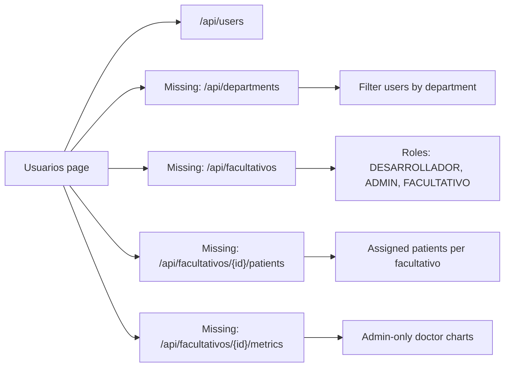

# API overview

This page summarizes the current REST API implemented by the Spring Boot
backend. The backend context path is `/v2`, so every route in this document must
be prefixed with the environment base URL.

## Base information

Radix exposes JSON endpoints for authentication, patients, treatments, medical
alerts, health metrics, smartwatches, messages, and catalog data.

| Property | Value |
|----------|-------|
| Production base URL | `https://api.raddix.pro/v2` |
| Local base URL | `http://localhost:8080/v2` |
| Context path | `/v2` |
| Format | JSON |
| Authentication | Mock token based on user ID or hardcoded admin token |

## Current endpoints

The following endpoints are implemented in `radix-api/src/main/java`.

### Authentication

Authentication endpoints create session-like tokens and register doctors or
patients through the current mock authorization model.

| Method | Path | Description |
|--------|------|-------------|
| `POST` | `/api/auth/token` | Exchanges OAuth client credentials for a token. |
| `POST` | `/api/auth/login` | Logs in a user with email and password. |
| `POST` | `/api/auth/register/doctor` | Registers a doctor from an admin context. |
| `POST` | `/api/auth/register/patient` | Registers a patient from a doctor context. |

### Users and doctors

Users are the canonical identity record. The frontend now treats admin and
facultativo users as the same people-management surface, so the old
Facultativos page is removed from the web app.

| Method | Path | Description |
|--------|------|-------------|
| `GET` | `/api/users` | Lists all users. |
| `GET` | `/api/users/role/{role}` | Lists users filtered by role. |
| `GET` | `/api/users/{id}` | Gets a user by ID. |
| `PUT` | `/api/users/{id}` | Updates editable user fields. |
| `DELETE` | `/api/users/{id}` | Deletes a user. |
| `GET` | `/api/doctors` | Lists users with doctor/facultativo role. |
| `GET` | `/api/doctors/{id}` | Gets a doctor/facultativo by ID. |
| `PUT` | `/api/doctors/{id}` | Updates doctor/facultativo information. |

### Patients

Patient endpoints manage active patient records and the relationship with the
linked user account.

| Method | Path | Description |
|--------|------|-------------|
| `POST` | `/api/patients/register` | Registers a patient and linked user. |
| `GET` | `/api/patients/profile/{userId}` | Gets a patient profile by user ID. |
| `GET` | `/api/patients/{id}` | Gets a patient by patient ID. |
| `GET` | `/api/patients` | Lists active patients. |
| `PUT` | `/api/patients/{id}` | Updates a patient. |
| `DELETE` | `/api/patients/{id}` | Deactivates or deletes a patient. |

### Treatments

Treatment endpoints support the dashboard treatment cards and the detailed
treatment page.

| Method | Path | Description |
|--------|------|-------------|
| `GET` | `/api/treatments` | Lists treatments. |
| `GET` | `/api/treatments/active` | Lists active treatments. |
| `GET` | `/api/treatments/{id}` | Gets a treatment by ID. |
| `GET` | `/api/treatments/patient/{patientId}` | Lists treatments by patient. |
| `POST` | `/api/treatments` | Creates a treatment. |
| `POST` | `/api/treatments/{id}/end` | Ends an active treatment. |

### Alerts

Alert endpoints support pending alerts, alert charts, and alert resolution.

| Method | Path | Description |
|--------|------|-------------|
| `GET` | `/api/alerts` | Lists doctor alerts. |
| `GET` | `/api/alerts/pending` | Lists unresolved alerts. |
| `GET` | `/api/alerts/patient/{patientId}` | Lists alerts by patient. |
| `PUT` | `/api/alerts/{id}/resolve` | Marks an alert as resolved. |

### Metrics and logs

Metrics endpoints provide patient health data, radiation logs, and treatment
measurements used by the dashboard charts.

| Method | Path | Description |
|--------|------|-------------|
| `GET` | `/api/health-metrics/patient/{patientId}` | Lists health metrics by patient. |
| `GET` | `/api/health-metrics/patient/{patientId}/latest` | Gets latest patient metrics. |
| `GET` | `/api/health-metrics/treatment/{treatmentId}` | Lists health metrics by treatment. |
| `POST` | `/api/health-metrics` | Creates health metrics. |
| `GET` | `/api/health-logs/patient/{patientId}` | Lists health logs by patient. |
| `GET` | `/api/radiation-logs/patient/{patientId}` | Lists radiation logs by patient. |
| `GET` | `/api/radiation-logs/treatment/{treatmentId}` | Lists radiation logs by treatment. |

### Devices, messages, and catalogs

These endpoints support smartwatch ingestion, patient messages, units, isotopes,
settings, and motivational game sessions.

| Method | Path | Description |
|--------|------|-------------|
| `POST` | `/api/watch/ingest` | Ingests watch data by IMEI. |
| `GET` | `/api/watch/{imei}/metrics` | Gets metrics by watch IMEI. |
| `GET` | `/api/watch/patient/{patientId}/latest` | Gets latest watch metrics by patient. |
| `POST` | `/api/smartwatches` | Registers a smartwatch. |
| `GET` | `/api/smartwatches` | Lists smartwatches. |
| `GET` | `/api/smartwatches/{id}` | Gets a smartwatch. |
| `GET` | `/api/smartwatches/patient/{patientId}` | Lists smartwatches by patient. |
| `PUT` | `/api/smartwatches/{id}` | Updates a smartwatch. |
| `DELETE` | `/api/smartwatches/{id}` | Deletes a smartwatch. |
| `GET` | `/api/messages/patient/{patientId}` | Lists patient messages. |
| `POST` | `/api/messages` | Creates a message. |
| `PUT` | `/api/messages/{id}/read` | Marks a message as read. |
| `GET` | `/api/isotopes` | Lists isotope catalog entries. |
| `GET` | `/api/isotopes/{id}` | Gets an isotope by ID. |
| `GET` | `/api/units` | Lists unit catalog entries. |
| `GET` | `/api/units/{id}` | Gets a unit by ID. |
| `GET` | `/api/settings/patient/{patientId}` | Gets patient settings. |
| `PUT` | `/api/settings/patient/{patientId}` | Updates patient settings. |
| `GET` | `/api/games/patient/{patientId}` | Lists patient game sessions. |
| `POST` | `/api/games` | Creates a game session. |
| `GET` | `/api/dashboard/stats` | Gets dashboard summary stats. |
| `GET` | `/docs` | Returns generated API documentation. |
| `GET` | `/actuator/health` | Returns Spring Actuator health status. |

## Roles

The frontend now uses three operational roles. The backend must normalize stored
values to these names when the production authorization layer is implemented.

- `DESARROLLADOR`: technical platform access.
- `ADMIN`: administrative access and also a facultativo for clinical workflows.
- `FACULTATIVO`: clinical user with patients, treatments, alerts, and optional
  department membership.

## Missing endpoints required by the current frontend

The current UI models departments, user filtering, facultativo metrics, and
patient assignments with mock data. These endpoints are still missing from the
backend.

| Method | Path | Purpose |
|--------|------|---------|
| `GET` | `/api/departments` | Lists departments available for facultativos. |
| `POST` | `/api/departments` | Creates a department. Admin only. |
| `PUT` | `/api/departments/{id}` | Renames or disables a department. Admin only. |
| `GET` | `/api/users?role=&departmentId=&q=` | Lists users with server-side filters. |
| `PATCH` | `/api/users/{id}/role` | Changes a user role to one of the supported roles. |
| `PATCH` | `/api/users/{id}/department` | Assigns or clears a user's department. |
| `GET` | `/api/facultativos` | Lists admin and facultativo users as clinical staff. |
| `GET` | `/api/facultativos/{id}/patients` | Lists patients assigned to one facultativo. |
| `PUT` | `/api/facultativos/{id}/patients` | Replaces assigned patients for one facultativo. |
| `GET` | `/api/facultativos/{id}/metrics` | Returns admin-only charts for one facultativo. |
| `GET` | `/api/facultativos/metrics?departmentId=` | Returns admin-only aggregate metrics by department. |

## Next steps

Implement departments and facultativo metrics in the backend before replacing
the frontend mock data on the users page.
