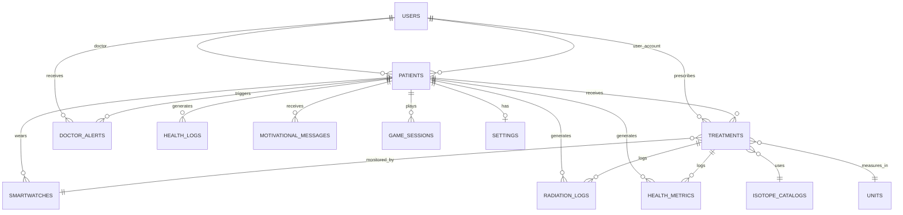

# Database Schema

Base de datos MySQL para el sistema Radix. Schema auto-generado desde entidades JPA con `ddl-auto: update`.

---

## Diagrama de Relaciones

---

## Tabla: users

Autenticación y gestión de usuarios.

| Columna | Tipo | Constraints |
|---------|------|-------------|
| id | INT | PK, AUTO_INCREMENT |
| first_name | VARCHAR(255) | NOT NULL |
| last_name | VARCHAR(255) | NOT NULL |
| email | VARCHAR(255) | UNIQUE, NOT NULL |
| password | VARCHAR(255) | NOT NULL |
| role | VARCHAR(50) | NOT NULL, DEFAULT 'FACULTATIVO' |
| created_at | DATETIME | DEFAULT CURRENT_TIMESTAMP |

### Roles Disponibles

- `DESARROLLADOR` - Acceso técnico y soporte de plataforma
- `ADMIN` - Administrador del sistema y facultativo clínico
- `FACULTATIVO` - Profesional médico

> [!note] Departamentos pendientes
> La UI ya permite modelar departamentos para facultativos, pero la tabla
> `departments` y la relación opcional desde `users` todavía no existen en el
> backend.

---

## Tabla: patients

Perfil de paciente e información médica.

| Columna | Tipo | Constraints |
|---------|------|-------------|
| id | INT | PK, AUTO_INCREMENT |
| full_name | VARCHAR(255) | NOT NULL |
| phone | VARCHAR(50) | NULL |
| address | VARCHAR(500) | NULL |
| is_active | BOOLEAN | DEFAULT TRUE |
| family_access_code | VARCHAR(100) | UNIQUE |
| fk_user_id | INT | FK → users.id (SET NULL) |
| fk_doctor_id | INT | FK → users.id (SET NULL) |
| created_at | DATETIME | DEFAULT CURRENT_TIMESTAMP |

### Índices

- PRIMARY KEY (id)
- UNIQUE (family_access_code)
- INDEX (fk_user_id)
- INDEX (fk_doctor_id)

---

## Tabla: smartwatches

Dispositivos wearables vinculados a pacientes.

| Columna | Tipo | Constraints |
|---------|------|-------------|
| id | INT | PK, AUTO_INCREMENT |
| fk_patient_id | INT | FK → patients.id (CASCADE) |
| imei | VARCHAR(100) | UNIQUE, NOT NULL |
| mac_address | VARCHAR(100) | UNIQUE, NOT NULL |
| model | VARCHAR(100) | NULL |
| is_active | BOOLEAN | DEFAULT TRUE |

### Notas

- IMEI y MACAddress son únicos para identificación de dispositivo
- Posible tener múltiples smartwatches por paciente

---

## Tabla: isotope_catalogs

Catálogo de radioisótopos para tratamientos.

| Columna | Tipo | Constraints |
|---------|------|-------------|
| id | INT | PK, AUTO_INCREMENT |
| name | VARCHAR(255) | NOT NULL |
| symbol | VARCHAR(50) | NULL |
| type | VARCHAR(100) | NULL |
| half_life | DOUBLE | NULL |
| half_life_unit | VARCHAR(50) | NULL |

### Radioisótopos Comunes

| ID | Name | Symbol | Type | Half-Life |
|----|------|--------|------|-----------|
| 1 | Iodine-131 | I-131 | Thyroid | 8 días |
| 2 | Technetium-99m | Tc-99m | Diagnostic | 6 horas |
| 3 | Yttrium-90 | Y-90 | Therapy | 2.7 días |
| 4 | Lutetium-177 | Lu-177 | Therapy | 6.7 días |

---

## Tabla: units

Unidades de medida para radiación y dosis.

| Columna | Tipo | Constraints |
|---------|------|-------------|
| id | INT | PK, AUTO_INCREMENT |
| name | VARCHAR(255) | NOT NULL |
| symbol | VARCHAR(50) | NOT NULL |

### Unidades Comunes

| ID | Name | Symbol |
|----|------|--------|
| 1 | Millicurie | mCi |
| 2 | Becquerel | Bq |
| 3 | Gray | Gy |
| 4 | Sievert | Sv |

---

## Tabla: treatments

Planes de tratamiento de medicina nuclear.

| Columna | Tipo | Constraints |
|---------|------|-------------|
| id | INT | PK, AUTO_INCREMENT |
| fk_patient_id | INT | FK → patients.id (CASCADE) |
| fk_doctor_id | INT | FK → users.id (CASCADE) |
| fk_radioisotope_id | INT | FK → isotope_catalogs.id (CASCADE) |
| fk_smartwatch_id | INT | FK → smartwatches.id (SET NULL) |
| fk_unit_id | INT | FK → units.id (CASCADE) |
| room | INT | NULL |
| initial_dose | DOUBLE | NULL |
| safety_threshold | DOUBLE | NULL |
| isolation_days | INT | NULL |
| start_date | DATETIME | NOT NULL |
| end_date | DATETIME | NULL |
| is_active | BOOLEAN | DEFAULT TRUE |

---

## Tabla: radiation_logs

Registros temporales de niveles de radiación.

| Columna | Tipo | Constraints |
|---------|------|-------------|
| id | INT | PK, AUTO_INCREMENT |
| fk_patient_id | INT | FK → patients.id (CASCADE) |
| fk_treatment_id | INT | FK → treatments.id (SET NULL) |
| radiation_level | DOUBLE | NOT NULL |
| timestamp | DATETIME | DEFAULT CURRENT_TIMESTAMP |

---

## Tabla: health_logs

Métricas generales de salud desde wearables.

| Columna | Tipo | Constraints |
|---------|------|-------------|
| id | INT | PK, AUTO_INCREMENT |
| fk_patient_id | INT | FK → patients.id (CASCADE) |
| bpm | INT | NULL |
| steps | INT | NULL |
| distance | DOUBLE | NULL |
| timestamp | DATETIME | DEFAULT CURRENT_TIMESTAMP |

---

## Tabla: health_metrics

Métricas específicas durante tratamiento.

| Columna | Tipo | Constraints |
|---------|------|-------------|
| id | INT | PK, AUTO_INCREMENT |
| fk_treatment_id | INT | FK → treatments.id (SET NULL) |
| fk_patient_id | INT | FK → patients.id (SET NULL) |
| bpm | INT | NULL |
| steps | INT | NULL |
| distance | DOUBLE | NULL |
| current_radiation | DOUBLE | NULL |
| recorded_at | DATETIME | NULL |

---

## Tabla: doctor_alerts

Alertas generadas durante monitoreo de tratamiento.

| Columna | Tipo | Constraints |
|---------|------|-------------|
| id | INT | PK, AUTO_INCREMENT |
| fk_patient_id | INT | FK → patients.id (CASCADE) |
| fk_treatment_id | INT | FK → treatments.id (CASCADE) |
| alert_type | VARCHAR(100) | NULL |
| message | TEXT | NULL |
| is_resolved | BOOLEAN | DEFAULT FALSE |
| created_at | DATETIME | DEFAULT CURRENT_TIMESTAMP |

---

## Tabla: motivational_messages

Mensajes motivacionales para pacientes.

| Columna | Tipo | Constraints |
|---------|------|-------------|
| id | INT | PK, AUTO_INCREMENT |
| fk_patient_id | INT | FK → patients.id (CASCADE) |
| message_text | TEXT | NOT NULL |
| is_read | BOOLEAN | DEFAULT FALSE |
| sent_at | DATETIME | DEFAULT CURRENT_TIMESTAMP |

---

## Tabla: game_sessions

Datos de gamificación para engagement de pacientes.

| Columna | Tipo | Constraints |
|---------|------|-------------|
| id | INT | PK, AUTO_INCREMENT |
| fk_patient_id | INT | FK → patients.id (CASCADE) |
| score | INT | DEFAULT 0 |
| level_reached | INT | DEFAULT 1 |
| played_at | DATETIME | DEFAULT CURRENT_TIMESTAMP |

---

## Tabla: settings

Preferencias de configuración por paciente.

| Columna | Tipo | Constraints |
|---------|------|-------------|
| id | INT | PK, AUTO_INCREMENT |
| fk_patient_id | INT | FK → patients.id (CASCADE), UNIQUE |
| unit_preference | VARCHAR(50) | DEFAULT 'metric' |
| theme | VARCHAR(50) | DEFAULT 'light' |
| notifications_enabled | BOOLEAN | DEFAULT TRUE |
| updated_at | DATETIME | ON UPDATE CURRENT_TIMESTAMP |

---

## Índices Globally

| Tabla | Índice | Tipo |
|-------|--------|------|
| users | email | UNIQUE |
| patients | family_access_code | UNIQUE |
| smartwatches | imei | UNIQUE |
| smartwatches | mac_address | UNIQUE |
| settings | fk_patient_id | UNIQUE |

---

## Datos de Ejemplo

### Usuarios

| ID | firstName | lastName | email | role |
|----|-----------|----------|-------|------|
| 1 | Radix | Admin | Radix | ADMIN |

### Pacientes

8 pacientes activos con tratamientos corriendo.

### Radioisótopos

8 isotopos incluyendo I-131, Tc-99m, Y-90, Lu-177.

### Unidades

8 unidades incluyendo mCi, Bq, Gy, Sv.

---

## Ver También

- [[Backend/Entities-Overview]] - Entidades JPA detalladas
- [[Backend/Deployment]] - Configuración de base de datos en producción
