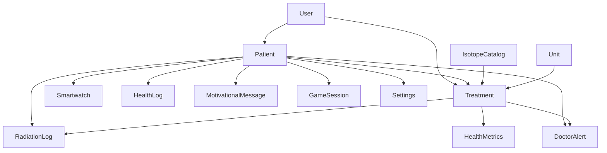

# JPA Entities Overview

Todas las entidades están en el paquete `com.project.radix.Model` y son gestionadas por JPA/Hibernate con `ddl-auto: update`.

---

## User

```java
@Entity
@Table(name = "users")
public class User {
    @Id
    @GeneratedValue(strategy = GenerationType.IDENTITY)
    private Integer id;

    @Column(nullable = false)
    private String firstName;

    @Column(nullable = false)
    private String lastName;

    @Column(unique = true, nullable = false)
    private String email;

    @Column(nullable = false)
    private String password;

    @Column(nullable = false)
    private String role = "Doctor";

    @Column(name = "created_at")
    private LocalDateTime createdAt = LocalDateTime.now();
}
```

### Notas

- Tabla usa nombre `users` (plural) porque `user` es keyword reservado en H2
- Roles: ADMIN, DOCTOR, PATIENT
- Relaciones: One-to-Many con Patient (como user y como doctor)

---

## Patient

```java
@Entity
@Table(name = "patients")
public class Patient {
    @Id
    @GeneratedValue(strategy = GenerationType.IDENTITY)
    private Integer id;

    @Column(name = "full_name", nullable = false)
    private String fullName;

    @Column(name = "phone")
    private String phone;

    @Column(name = "address")
    private String address;

    @Column(name = "is_active")
    private Boolean isActive = true;

    @Column(name = "family_access_code", unique = true)
    private String familyAccessCode;

    @Column(name = "fk_user_id")
    private Integer fkUserId;

    @Column(name = "fk_doctor_id")
    private Integer fkDoctorId;

    @Column(name = "created_at")
    private LocalDateTime createdAt;

    @ManyToOne(fetch = FetchType.LAZY)
    @JoinColumn(name = "fk_user_id", insertable = false, updatable = false)
    private User user;

    @ManyToOne(fetch = FetchType.LAZY)
    @JoinColumn(name = "fk_doctor_id", insertable = false, updatable = false)
    private User doctor;
}
```

### Notas

- `familyAccessCode` se genera como UUID para acceso de familiares
- Relación con User (cuenta de acceso) y User (doctor asignado)
- `isActive` indica si el paciente está en tratamiento

---

## Smartwatch

```java
@Entity
@Table(name = "smartwatches")
public class Smartwatch {
    @Id
    @GeneratedValue(strategy = GenerationType.IDENTITY)
    private Integer id;

    @Column(name = "fk_patient_id")
    private Integer fkPatientId;

    @Column(unique = true, nullable = false)
    private String imei;

    @Column(name = "mac_address", unique = true, nullable = false)
    private String macAddress;

    private String model;

    @Column(name = "is_active")
    private Boolean isActive = true;
}
```

### Notas

-IMEI y MAC Address son únicos (identificación de dispositivo)
- Un paciente puede tener varios smartwatches
- Usa `FetchType.LAZY` para relación con Patient

---

## Treatment

```java
@Entity
@Table(name = "treatments")
public class Treatment {
    @Id
    @GeneratedValue(strategy = GenerationType.IDENTITY)
    private Integer id;

    @Column(name = "fk_patient_id")
    private Integer fkPatientId;

    @Column(name = "fk_doctor_id")
    private Integer fkDoctorId;

    @Column(name = "fk_radioisotope_id")
    private Integer fkRadioisotopeId;

    @Column(name = "fk_smartwatch_id")
    private Integer fkSmartwatchId;

    @Column(name = "fk_unit_id")
    private Integer fkUnitId;

    private Integer room;

    @Column(name = "initial_dose")
    private Double initialDose;

    @Column(name = "safety_threshold")
    private Double safetyThreshold;

    @Column(name = "isolation_days")
    private Integer isolationDays;

    @Column(name = "start_date")
    private LocalDateTime startDate;

    @Column(name = "end_date")
    private LocalDateTime endDate;

    @Column(name = "is_active")
    private Boolean isActive = true;
}
```

### Notas

- Representa un tratamiento de medicina nuclear
- Vincula paciente, doctor, radioisótopo, smartwatch y unidad de medida
- Campos de seguridad: dose inicial, threshold, días de aislamiento

---

## IsotopeCatalog

```java
@Entity
@Table(name = "isotope_catalogs")
public class IsotopeCatalog {
    @Id
    @GeneratedValue(strategy = GenerationType.IDENTITY)
    private Integer id;

    @Column(nullable = false)
    private String name;

    private String symbol;

    private String type;

    @Column(name = "half_life")
    private Double halfLife;

    @Column(name = "half_life_unit")
    private String halfLifeUnit;
}
```

### Radioisótopos Comunes

| Nombre | Símbolo | Tipo | Half-Life |
|--------|---------|------|------------|
| Iodine-131 | I-131 | Thyroid | 8 días |
| Technetium-99m | Tc-99m | Diagnostic | 6 horas |
| Yttrium-90 | Y-90 | Therapy | 2.7 días |
| Lutetium-177 | Lu-177 | Therapy | 6.7 días |

---

## Unit

```java
@Entity
@Table(name = "units")
public class Unit {
    @Id
    @GeneratedValue(strategy = GenerationType.IDENTITY)
    private Integer id;

    @Column(nullable = false)
    private String name;

    @Column(nullable = false)
    private String symbol;
}
```

### Unidades Comunes

| Nombre | Símbolo | Uso |
|--------|---------|-----|
| Millicurie | mCi | Radiación |
| Becquerel | Bq | Radiación |
| Gray | Gy | Dosis absorbida |
| Sievert | Sv | Dosis equivalente |

---

## HealthLog

```java
@Entity
@Table(name = "health_logs")
public class HealthLog {
    @Id
    @GeneratedValue(strategy = GenerationType.IDENTITY)
    private Integer id;

    @Column(name = "fk_patient_id")
    private Integer fkPatientId;

    private Integer bpm;
    private Integer steps;
    private Double distance;

    @Column(name = "timestamp")
    private LocalDateTime timestamp = LocalDateTime.now();
}
```

### Notas

- Logs generales de salud desde wearables
- Diferente de HealthMetrics (que incluye radiación)

---

## HealthMetrics

```java
@Entity
@Table(name = "health_metrics")
public class HealthMetrics {
    @Id
    @GeneratedValue(strategy = GenerationType.IDENTITY)
    private Integer id;

    @Column(name = "fk_treatment_id")
    private Integer fkTreatmentId;

    @Column(name = "fk_patient_id")
    private Integer fkPatientId;

    private Integer bpm;
    private Integer steps;
    private Double distance;
    private Double currentRadiation;

    @Column(name = "recorded_at")
    private LocalDateTime recordedAt;
}
```

### Notas

- Métricas específicas durante tratamiento
- Incluye `currentRadiation` - nivel de radiación actual del paciente

---

## RadiationLog

```java
@Entity
@Table(name = "radiation_logs")
public class RadiationLog {
    @Id
    @GeneratedValue(strategy = GenerationType.IDENTITY)
    private Integer id;

    @Column(name = "fk_patient_id")
    private Integer fkPatientId;

    @Column(name = "fk_treatment_id")
    private Integer fkTreatmentId;

    @Column(name = "radiation_level")
    private Double radiationLevel;

    @Column(name = "timestamp")
    private LocalDateTime timestamp = LocalDateTime.now();
}
```

### Notas

- Registro temporal de niveles de radiación
- Vinculado a paciente y tratamiento específico

---

## DoctorAlert

```java
@Entity
@Table(name = "doctor_alerts")
public class DoctorAlert {
    @Id
    @GeneratedValue(strategy = GenerationType.IDENTITY)
    private Integer id;

    @Column(name = "fk_patient_id")
    private Integer fkPatientId;

    @Column(name = "fk_treatment_id")
    private Integer fkTreatmentId;

    @Column(name = "alert_type")
    private String alertType;

    @Column(name = "message")
    private String message;

    @Column(name = "is_resolved")
    private Boolean isResolved = false;

    @Column(name = "created_at")
    private LocalDateTime createdAt = LocalDateTime.now();
}
```

### Tipos de Alerta

- `RADIATION_HIGH` - Nivel de radiación crítico
- `HEART_RATE_ABNORMAL` - Frecuencia cardíaca anormal
- `TREATMENT_END` - Tratamiento finalizado
- `PATIENT_ESCAPE` - Paciente salió del área de aislamiento

---

## MotivationalMessage

```java
@Entity
@Table(name = "motivational_messages")
public class MotivationalMessage {
    @Id
    @GeneratedValue(strategy = GenerationType.IDENTITY)
    private Integer id;

    @Column(name = "fk_patient_id")
    private Integer fkPatientId;

    @Column(name = "message_text", nullable = false)
    private String messageText;

    @Column(name = "is_read")
    private Boolean isRead = false;

    @Column(name = "sent_at")
    private LocalDateTime sentAt = LocalDateTime.now();
}
```

### Notas

- Mensajes motivacionales para pacientes en aislamiento
- Sistema de gamificación para engagement

---

## GameSession

```java
@Entity
@Table(name = "game_sessions")
public class GameSession {
    @Id
    @GeneratedValue(strategy = GenerationType.IDENTITY)
    private Integer id;

    @Column(name = "fk_patient_id")
    private Integer fkPatientId;

    private Integer score = 0;

    @Column(name = "level_reached")
    private Integer levelReached = 1;

    @Column(name = "played_at")
    private LocalDateTime playedAt = LocalDateTime.now();
}
```

### Notas

- Gamificación para pacientes durante aislamiento
- Registra puntuación y nivel alcanzado

---

## Settings

```java
@Entity
@Table(name = "settings")
public class Settings {
    @Id
    @GeneratedValue(strategy = GenerationType.IDENTITY)
    private Integer id;

    @Column(name = "fk_patient_id")
    private Integer fkPatientId;

    @Column(name = "unit_preference")
    private String unitPreference = "metric";

    private String theme = "light";

    @Column(name = "notifications_enabled")
    private Boolean notificationsEnabled = true;

    @Column(name = "updated_at")
    private LocalDateTime updatedAt = LocalDateTime.now();
}
```

### Notas

- Preferencia de unidades (metric/imperial)
- Tema de la app (light/dark)
- Notificaciones habilitadas

---

## Relaciones Entre Entidades



## Ver También

- [[Backend/Database-Schema]] - Esquema SQL completo
- [[Backend/API-Overview]] - Vista general del API