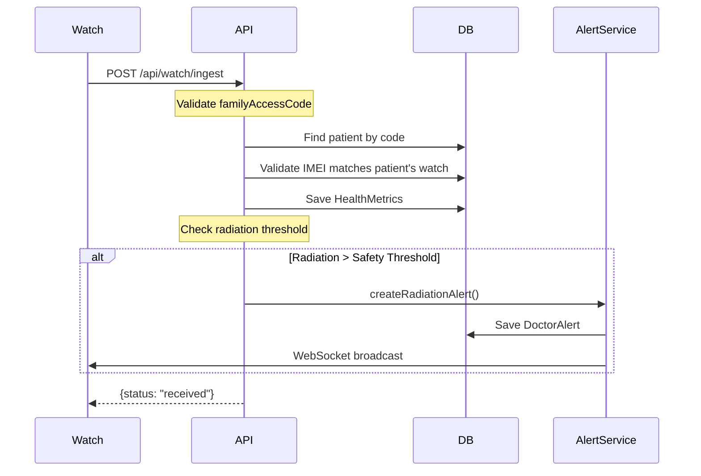

# Watch Data Ingestion API

## Endpoints

| Method | Path | Description | Auth |
|--------|------|-------------|------|
| POST | `/api/watch/ingest` | Receive data from smartwatch | FamilyAccessCode |
| GET | `/api/watch/{imei}/metrics` | Get metrics history | DOCTOR, ADMIN |
| GET | `/api/watch/patient/{patientId}/latest` | Get latest metrics | DOCTOR, ADMIN |

---

## POST /api/watch/ingest

Este endpoint recibe datos del reloj del paciente. No requiere autenticación via Bearer token - en su lugar valida el `familyAccessCode` que está configurado en el reloj.

### Request Body

```json
{
  "imei": "123456789012345",
  "familyAccessCode": "FAM-A1B2C3D4",
  "bpm": 72,
  "steps": 150,
  "distance": 0.5,
  "currentRadiation": 0.023,
  "recordedAt": "2026-04-28T10:30:00"
}
```

| Field | Type | Required | Description |
|-------|------|----------|-------------|
| `imei` | String | Yes | IMEI del smartwatch |
| `familyAccessCode` | String | Yes | Código de acceso familiar del paciente |
| `bpm` | Integer | No | Pulsaciones por minuto |
| `steps` | Integer | No | Pasos dados |
| `distance` | Double | No | Distancia recorrida (km) |
| `currentRadiation` | Double | Yes | Nivel de radiación actual (mCi) |
| `recordedAt` | LocalDateTime | No | Timestamp de la medición (default: now) |

### Flow



### Validation Rules

1. `familyAccessCode` must match an existing patient
2. `imei` must be registered to that patient
3. If radiation exceeds `safetyThreshold`, an alert is automatically created

### Response

```json
{
  "status": "received"
}
```

### Error Responses

| Code | Message | Cause |
|------|---------|-------|
| 400 | Invalid family access code | Code doesn't match any patient |
| 400 | Smartwatch not registered | IMEI not in system |
| 400 | Smartwatch not linked to this patient | IMEI belongs to different patient |

---

## GET /api/watch/{imei}/metrics

Obtiene el histórico de métricas para un reloj específico.

### Response

```json
[
  {
    "id": 45,
    "patientId": 1,
    "imei": "123456789012345",
    "bpm": 72,
    "steps": 150,
    "distance": 0.5,
    "currentRadiation": 0.023,
    "recordedAt": "2026-04-28T10:30:00"
  },
  {
    "id": 44,
    "patientId": 1,
    "imei": "123456789012345",
    "bpm": 70,
    "steps": 120,
    "distance": 0.4,
    "currentRadiation": 0.022,
    "recordedAt": "2026-04-28T10:20:00"
  }
]
```

---

## GET /api/watch/patient/{patientId}/latest

Obtiene las últimas métricas registradas para un paciente.

### Response

```json
{
  "id": 45,
  "patientId": 1,
  "imei": "123456789012345",
  "bpm": 72,
  "steps": 150,
  "distance": 0.5,
  "currentRadiation": 0.023,
  "recordedAt": "2026-04-28T10:30:00"
}
```

---

## HealthMetrics Model

```java
@Entity
@Table(name = "health_metrics")
public class HealthMetrics {
    @Id
    @GeneratedValue(strategy = GenerationType.IDENTITY)
    private Integer id;

    @Column(name = "fk_treatment_id")
    private Integer fkTreatmentId;

    @Column(name = "fk_patient_id")
    private Integer fkPatientId;

    private Integer bpm;
    private Integer steps;
    private Double distance;
    private Double currentRadiation;

    @Column(name = "recorded_at")
    private LocalDateTime recordedAt;
}
```

---

## Example: Send Data from Watch (curl)

```bash
curl -X POST http://localhost:8080/v2/api/watch/ingest \
  -H "Content-Type: application/json" \
  -d '{
    "imei": "123456789012345",
    "familyAccessCode": "FAM-A1B2C3D4",
    "bpm": 72,
    "steps": 150,
    "distance": 0.5,
    "currentRadiation": 0.023
  }'
```

---

## Ver También

- [[Backend/Treatment-Endpoints]] - Treatment management
- [[Backend/WebSocket-Alerts]] - Real-time alert system
- [[Frontend/Pages-Deep-Dive]] - Frontend pages for viewing metrics