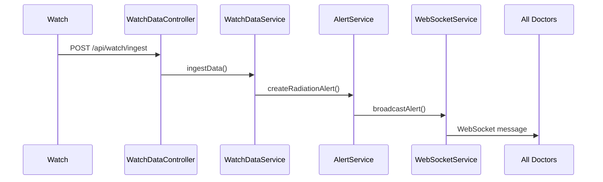

# WebSocket Alerts System

## Overview

El sistema usa WebSocket para notificar a los doctores en tiempo real cuando ocurre una alerta (ej: radiación exceeds threshold).

## WebSocket Endpoint

```
ws://localhost:8080/v2/ws/alerts
```

Los doctores se conectan a este endpoint y reciben alertas push automaticamente cuando:
1. Un paciente supera el threshold de radiación
2. Un médico crea una alerta manual
3. Se resuelve una alerta (opcional)

---

## Message Format

Los mensajes JSON enviados a los clientes tienen el siguiente formato:

```json
{
  "id": 12,
  "patientId": 5,
  "patientName": "Maria Garcia",
  "treatmentId": 3,
  "alertType": "RADIATION_HIGH",
  "message": "Radiation level (0.045 mCi) exceeded safety threshold (0.015 mCi)",
  "isResolved": false,
  "createdAt": "2026-04-28T10:30:00"
}
```

### Alert Types

| Type | Description | Trigger |
|------|-------------|---------|
| `RADIATION_HIGH` | Nivel de radiación excede threshold | Auto from WatchDataService |
| `BPM_ABNORMAL` | Pulso anormalmente alto/bajo | Future enhancement |
| `MANUAL` | Alerta creada manualmente | Future enhancement |

---

## Client Integration (Frontend)

### JavaScript Client Example

```javascript
class AlertWebSocket {
  constructor(url) {
    this.url = url;
    this.ws = null;
    this.handlers = [];
  }

  connect() {
    this.ws = new WebSocket(this.url);

    this.ws.onopen = () => {
      console.log('WebSocket connected to alert system');
    };

    this.ws.onmessage = (event) => {
      const alert = JSON.parse(event.data);
      this.handlers.forEach(handler => handler(alert));
    };

    this.ws.onclose = () => {
      console.log('WebSocket disconnected');
      // Optionally reconnect after delay
      setTimeout(() => this.connect(), 5000);
    };
  }

  onAlert(handler) {
    this.handlers.push(handler);
  }

  disconnect() {
    if (this.ws) {
      this.ws.close();
    }
  }
}

// Usage
const alertWs = new AlertWebSocket('ws://localhost:8080/v2/ws/alerts');
alertWs.connect();

alertWs.onAlert((alert) => {
  console.log('New alert:', alert.message);
  // Show notification, update UI, etc.
});
```

---

## Backend Architecture

### WebSocketNotificationService

```java
@Service
public class WebSocketNotificationService extends TextWebSocketHandler {

    private final Set<WebSocketSession> sessions = ConcurrentHashMap.newKeySet();

    public void broadcastAlert(AlertResponse alert) {
        String json = objectMapper.writeValueAsString(alert);
        TextMessage message = new TextMessage(json);
        sessions.forEach(session -> {
            if (session.isOpen()) {
                session.sendMessage(message);
            }
        });
    }

    @Override
    public void afterConnectionEstablished(WebSocketSession session) {
        sessions.add(session);
    }

    @Override
    public void afterConnectionClosed(WebSocketSession session, CloseStatus status) {
        sessions.remove(session);
    }
}
```

### Alert Flow



---

## REST Endpoints for Alerts

| Method | Path | Description |
|--------|------|-------------|
| GET | `/api/alerts` | Get all alerts |
| GET | `/api/alerts/pending` | Get unresolved alerts |
| GET | `/api/alerts/patient/{patientId}` | Get alerts for patient |
| PUT | `/api/alerts/{id}/resolve` | Mark alert as resolved |

---

## Frontend Alert Component

```tsx
// AlertBell.tsx
import { useEffect, useState } from 'react';

export function AlertBell() {
  const [pendingCount, setPendingCount] = useState(0);
  const [alerts, setAlerts] = useState([]);

  useEffect(() => {
    const ws = new WebSocket('ws://localhost:8080/v2/ws/alerts');

    ws.onmessage = (event) => {
      const alert = JSON.parse(event.data);
      setAlerts(prev => [alert, ...prev]);
      setPendingCount(prev => prev + 1);
    };

    return () => ws.close();
  }, []);

  return (
    <button className="relative">
      <BellIcon />
      {pendingCount > 0 && (
        <span className="absolute -top-1 -right-1 bg-red-500 text-white rounded-full w-5 h-5 text-xs flex items-center justify-center">
          {pendingCount}
        </span>
      )}
    </button>
  );
}
```

---

## Ver También

- [[Backend/Watch-Data-Ingestion]] - Watch data API that triggers alerts
- [[Backend/Treatment-Endpoints]] - Treatment management with thresholds
- [[Frontend/Components]] - Frontend components for alerts