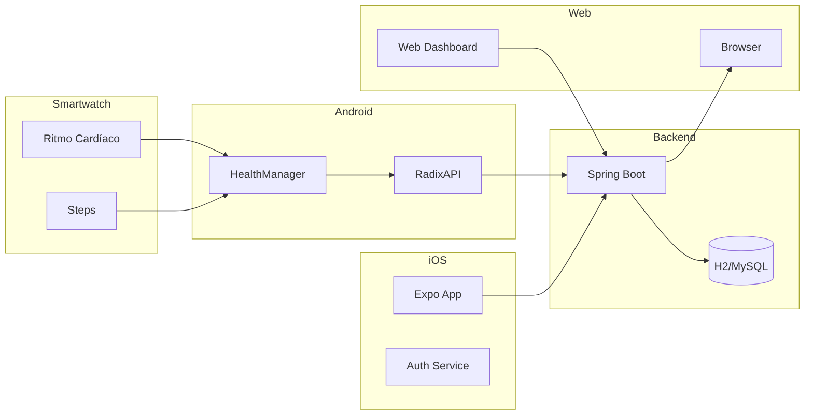

# Development Setup

## Requisitos Previos

| Herramienta | Versión Mínima | Propósito |
|-------------|----------------|-----------|
| Java | 21 | Backend (Spring Boot) |
| Node.js | 18+ | Frontend, iOS |
| npm | 9+ | Manejo de paquetes |
| Gradle | 9.3+ | Android, Smartwatch |
| Docker | 24+ | Contenedores (opcional) |
| Android Studio | - | Android emulator (opcional) |
| Xcode | 15+ | iOS simulator (macOS only) |

---

## 1. Backend (radix-api)

### Setup Local

```bash
cd radix-api
./mvnw spring-boot:run
```

### Lo que pasa

1. Maven descarga dependencias
2. Spring Boot inicia con H2 en memoria
3. Schema se auto-crea desde entidades JPA
4. DataLoader inserta admin user si no existe

### URLs

| URL | Descripción |
|-----|-------------|
| `http://localhost:8080/v2/` | API root (info) |
| `http://localhost:8080/v2/api/auth/login` | Login endpoint |
| `http://localhost:8080/v2/actuator/health` | Health check |
| `http://localhost:8080/v2/docs` | Documentación |

### Credenciales por Defecto

> [!tip] Admin Hardcoded
> ```
> Email: Radix
> Password: radixelmejor1
> ```

### Configuración

El archivo `src/main/resources/application.properties` define valores por defecto:

```properties
# H2 Database (default - desarrollo local)
spring.datasource.url=jdbc:h2:mem:radixdb;DB_CLOSE_DELAY=-1
spring.datasource.driver-class-name=org.h2.Driver

# Puerto
server.port=8080

# Context path (API version)
server.servlet.context-path=/v2
```

### Comandos Útiles

```bash
# Desarrollo
./mvnw spring-boot:run

# Tests
./mvnw test

# Un test específico
./mvnw test -Dtest=ClassName

# Build JAR
./mvnw clean package -DskipTests

# Con perfil prod (MySQL)
./mvnw spring-boot:run -Dspring-boot.run.profiles=prod
```

### Variables de Entorno (Producción)

| Variable | Default | Descripción |
|----------|---------|-------------|
| DATABASE_URL | jdbc:h2:mem:radixdb | Connection URL |
| DATABASE_DRIVER | org.h2.Driver | Driver class |
| SERVER_PORT | 8080 | Puerto |
| FHIR_BASE_URL | http://localhost:8080/v2 | FHIR server |

---

## 2. Frontend Web (radix-web)

### Setup Local

```bash
cd radix-web
npm install
npm run dev
```

### Lo que pasa

1. npm install descarga dependencias (Astro, React, Tailwind)
2. Astro inicia servidor de desarrollo
3. Puerto 4321 por defecto

### URLs

| URL | Descripción |
|-----|-------------|
| `http://localhost:4321` | Página principal (redirect a /login) |
| `http://localhost:4321/login` | Login |
| `http://localhost:4321/dashboard` | Dashboard |
| `http://localhost:4321/usuarios` | Usuarios y facultativos |
| `http://localhost:4321/mi-perfil` | Perfil del usuario actual |
| `http://localhost:4321/configuracion` | Configuración |

### Configuración de API

El frontend consume el backend en:
- Desarrollo: `http://localhost:8080/v2`
- Producción: `https://api.raddix.pro/v2`

No hay archivo `.env` - la URL está hardcoded en los componentes.

### Estructura de Desarrollo

```
radix-web/
├── src/
│   ├── pages/           # Rutas Astro (file-based)
│   ├── components/       # Componentes React
│   ├── layouts/         # Layouts Astro
│   └── env.d.ts         # Tipos de entorno
├── astro.config.mjs     # Config de Astro
├── tailwind.config.mjs   # Config de Tailwind
└── package.json
```

### Comandos Útiles

```bash
# Desarrollo
npm run dev

# Build producción
npm run build

# Preview build
npm run preview

# Type check
npx tsc --noEmit
```

---

## 3. Android App (radix_app)

### Setup Local

```bash
cd radix_app
./gradlew assembleDebug
```

### Instalar en Emulador/Dispositivo

```bash
# Con dispositivo conectado (USB debugging)
./gradlew installDebug

# Listar dispositivos disponibles
adb devices

# Instalar APK manualmente
adb install app/build/outputs/apk/debug/app-debug.apk
```

### API Configuration

La URL del API está en `Retrofit/RadixAPI.kt`:

```kotlin
.baseUrl("https://api.raddix.pro/v2/")
```

Para desarrollo local, cambiar a:
```kotlin
.baseUrl("http://localhost:8080/v2/")
```

### Arquitectura de Pantallas

```
LogIn (Activity)
    ↓ (login exitoso)
MainActivity (BottomNavigation)
    ├── Home (Fragment)
    ├── Rellotge (Fragment) ← conecta con smartwatch
    └── Configuracio (Fragment)
```

### Permisos Requeridos

```xml
<uses-permission android:name="android.permission.INTERNET" />
<uses-permission android:name="android.permission.BODY_SENSORS" />
<uses-permission android:name="android.permission.ACTIVITY_RECOGNITION" />
```

### Build Variants

| Variant | Comando | Output |
|---------|---------|--------|
| Debug | `./gradlew assembleDebug` | `app-debug.apk` |
| Release | `./gradlew assembleRelease` | `app-release.apk` |

### Estructura del Proyecto

```
radix_app/
├── app/
│   ├── src/main/java/com/example/radix/
│   │   ├── LogIn.kt           # Login Activity
│   │   ├── MainActivity.kt    # Container con bottom nav
│   │   ├── Home.kt           # Fragment home
│   │   ├── Rellotge.kt       # Fragment smartwatch
│   │   ├── Configuracio.kt   # Fragment config
│   │   ├── AcessFamiliar.kt  # Login familiar
│   │   ├── CambiarPin.kt     # Cambio PIN
│   │   ├── Retrofit/
│   │   │   ├── RadixAPI.kt   # Config Retrofit
│   │   │   ├── RadixService.kt # Interface API
│   │   │   └── Model.kt      # Data classes
│   │   └── ViewModel/
│   │       ├── LoginViewModel.kt
│   │       └── ErrorDialog.kt
│   └── src/main/res/
│       └── layout/           # XML layouts
└── build.gradle.kts
```

---

## 4. iOS App (radix-ios)

### Setup Local

```bash
cd radix-ios
npm install
npx expo start
```

### Lo que pasa

1. npm install descarga dependencias (Expo SDK 52)
2. Expo inicia Metro bundler
3. QR code aparece para conectar con Expo Go app

### Configuración de API

El archivo `.env` define la URL del API:

```bash
EXPO_PUBLIC_API_URL=http://localhost:8080/v2
```

### Ejecutar en iOS Simulator

```bash
# Opción 1: Con Expo
npx expo run:ios

# Opción 2: Con Xcode directamente
# Abrir ios/radix-ios.xcworkspace en Xcode
# Seleccionar simulator y presionar Run
```

### Ejecutar en Android Emulator

```bash
npx expo run:android
```

### URLs y Rutas

| Ruta | Descripción |
|------|-------------|
| `/` | Redirect a /login |
| `/login` | Pantalla de login |
| `/dashboard` | Dashboard principal |
| `/profile` | Perfil de usuario |
| `/settings` | Configuración |
| `/health` | Métricas de salud |
| `/treatment` | Info tratamiento |
| `/alerts` | Alertas médicas |

### Estructura del Proyecto

```
radix-ios/
├── src/
│   ├── app/              # Expo Router (file-based routing)
│   │   ├── _layout.tsx   # Root layout
│   │   ├── index.tsx     # Redirect
│   │   ├── login.tsx
│   │   ├── dashboard.tsx
│   │   └── ...
│   ├── types/
│   │   └── index.ts      # TypeScript interfaces
│   ├── services/
│   │   └── api.ts        # Cliente API
│   ├── hooks/
│   │   ├── useAuth.ts    # Hook auth
│   │   └── useApi.ts
│   └── utils/
│       └── date.ts
├── app.json              # Config Expo
└── package.json
```

### Comandos Útiles

```bash
# Dev server
npx expo start

# iOS
npx expo run:ios

# Android
npx expo run:android

# Web
npx expo start --web

# Type check
npm run typecheck

# Lint
npm run lint
```

---

## 5. Smartwatch App (radix_reloj)

### Setup Local

```bash
cd radix_reloj
./gradlew assembleDebug
```

### Instalar en Wear OS Emulator/Device

```bash
./gradlew installDebug
```

### API Configuration

La integración con API está preparada pero no implementada aún. Dependencias incluidas:

```kotlin
implementation("com.squareup.retrofit2:retrofit:2.9.0")
implementation("com.squareup.retrofit2:converter-gson:2.9.0")
```

### Sensores

La app usa Health Services para recopilar:
- Ritmo cardíaco (BPM)
- Pasos

### Permisos

```xml
<uses-permission android:name="android.permission.BODY_SENSORS" />
<uses-permission android:name="android.permission.ACTIVITY_RECOGNITION" />
```

### Arquitectura de Pantallas

```
MainActivity
    ↓
SwipeDismissableNavHost
    ├── MainScreen (start) → BPM, Steps
    │       ↓ (swipe down)
    └── MenuScreen
            ├── PowerScreen
            ├── BatteryScreen
            ├── HealthScreen
            ├── PatientScreen
            └── GameScreen
```

### Estructura del Proyecto

```
radix_reloj/
├── app/src/main/java/com/radioisotopos/radix/presentation/
│   ├── MainActivity.kt       # Entry point
│   ├── Screen.kt             # Rutas de navegación
│   ├── MainScreen.kt         # Pantalla principal
│   ├── AlertaRadiacionDialog.kt
│   ├── theme/
│   │   ├── Theme.kt
│   │   └── Color.kt
│   ├── menu/
│   │   ├── MenuScreen.kt
│   │   ├── PlaceholderScreens.kt
│   │   └── HealthScreen.kt
│   └── sensors/
│       └── HealthManager.kt  # Manejo de sensores
└── build.gradle.kts
```

---

## 6. Desarrollo Simultáneo

Para correr todos los módulos localmente:

### Terminal 1: Backend

```bash
cd radix-api
./mvnw spring-boot:run
# Puerto: 8080
```

### Terminal 2: Frontend Web

```bash
cd radix-web
npm run dev
# Puerto: 4321
```

### Terminal 3: iOS (Expo)

```bash
cd radix-ios
npx expo start
# Puerto: 19000 (Metro)
```

### Terminal 4: Android

Para instalar el APK:
```bash
cd radix_app
./gradlew installDebug
```

---

## Flujo de Datos Completo



---

## Troubleshooting

### Backend no responde

```bash
# Verificar que esté corriendo
curl http://localhost:8080/v2/actuator/health

# Ver logs
./mvnw spring-boot:run --verbose
```

### Frontend no conecta a Backend

1. Verificar que backend esté corriendo en puerto 8080
2. Verificar context path sea `/v2`
3. Revisar CORS settings en AuthController

### Android APK crash

```bash
# Desinstalar y reinstall
adb uninstall com.example.radix
./gradlew installDebug
```

### iOS Metro bundler issues

```bash
# Reset cache
npx expo start --clear

# Reinstalar pods
cd ios && pod install && cd ..
```

---

## Ver También

- [[Backend/API-Overview]] - Endpoints del API
- [[Backend/Deployment]] - Despliegue en producción
- [[Frontend/Frontend-Overview]] - Documentación frontend
- [[Movil/Android-Overview]] - App Android
- [[Movil/iOS-Overview]] - App iOS
- [[Reloj/Reloj-Overview]] - App smartwatch
