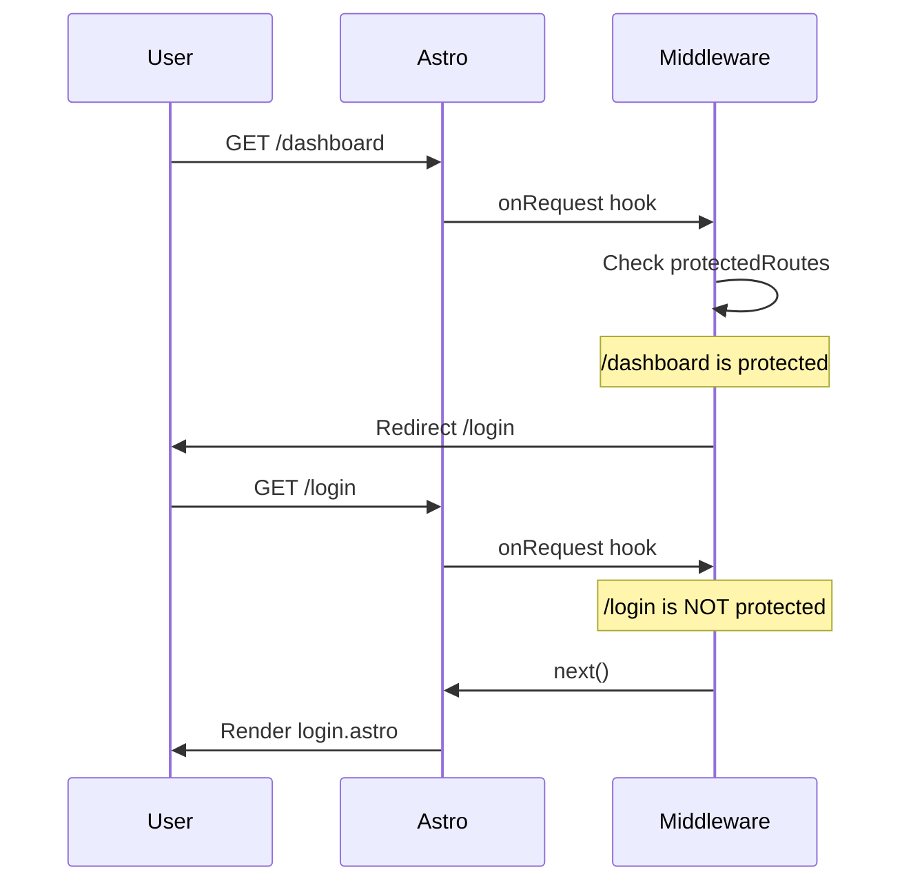
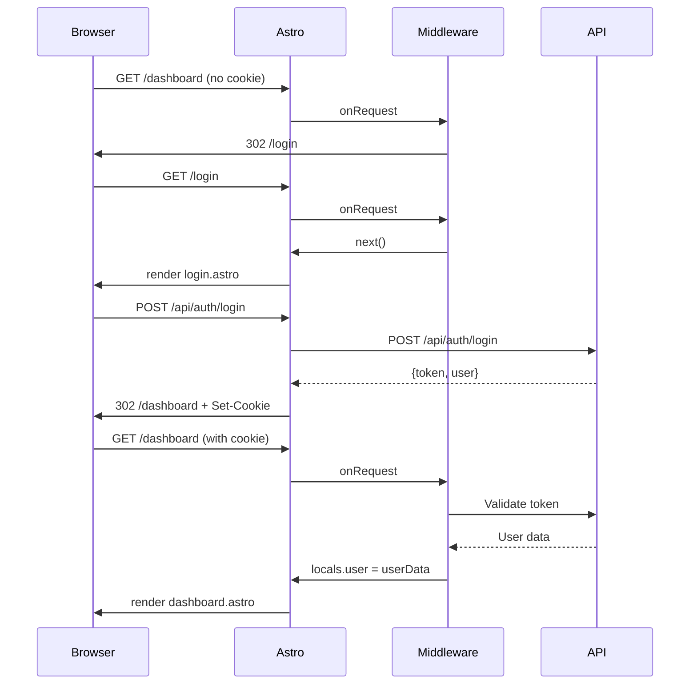

# Frontend Deep Dive - Pages

## Arquitectura de Páginas en Astro

El sistema de routing en Astro se basa en archivos `.astro` y `.tsx` en `src/pages/`. Cada archivo representa una ruta.

```
radix-web/src/pages/
├── index.astro          → /
├── login.astro          → /login
├── register.astro       → /register
├── dashboard.astro      → /dashboard
├── usuarios.astro       → /usuarios
├── tratamientos.astro  → /tratamientos
└── dispositivos.astro  → /dispositivos
```

---

## index.astro - Landing Page

**Ruta**: `/`

### Frontmatter

```astro
---
const { user } = Astro.locals;
if (user) return Astro.redirect('/dashboard');
---
```

**Lógica**: Si el usuario ya está logueado (existe `Astro.locals.user`), redirige inmediatamente a `/dashboard`.

### Template

```astro
<html>
  <head>
    <title>Radix - Health Management</title>
    <link href="/favicon.svg" type="image/svg+xml" />
  </head>
  <body class="bg-gray-900 text-white min-h-screen">
    <Header />
    <main class="container mx-auto px-4 py-16">
      <!-- Hero Section -->
      <div class="text-center mb-16">
        <h1 class="text-5xl font-bold mb-4">Radix</h1>
        <p class="text-xl text-gray-400">Sistema de Gestión de Salud</p>
        <div class="flex gap-4 justify-center mt-8">
          <a href="/login" class="btn-primary">Iniciar Sesión</a>
          <a href="/register" class="btn-secondary">Registrarse</a>
        </div>
      </div>

      <!-- Features Grid -->
      <div class="grid md:grid-cols-3 gap-8">
        <!-- Feature Cards -->
        <FeatureCard icon="👨‍⚕️" title="Doctores" desc="Gestiona tu equipo médico" />
        <FeatureCard icon="👥" title="Pacientes" desc="Control total sobre pacientes" />
        <FeatureCard icon="📊" title="Tratamientos" desc="Seguimiento detallado" />
      </div>

      <!-- Footer -->
      <Footer />
    </main>
  </body>
</html>
```

### Componentes Importados

| Componente | Ubicación | Props |
|------------|-----------|-------|
| `Header` | `../components/layout/Header.astro` | Ninguno |
| `Footer` | `../components/layout/Footer.astro` | Ninguno |
| `FeatureCard` | Inline | `icon`, `title`, `desc` |

### Estilos

Clases de Tailwind directamente en el template:
- `bg-gray-900`: Fondo oscuro
- `text-white`: Texto blanco
- `container mx-auto`: Centrado con max-width
- `grid-cols-3`: 3 columnas en desktop

---

## login.astro - Página de Login

**Ruta**: `/login`

### Frontmatter

```astro
---
const { user } = Astro.locals;
if (user) return Astro.redirect('/dashboard');
---
```

**Misma lógica**: Usuario logueado → redirige a dashboard.

### Imports

```astro
import LoginForm from '../components/auth/LoginForm';
```

### Template

```astro
<Layout title="Iniciar Sesión">
  <div class="min-h-[80vh] flex items-center justify-center px-4">
    <div class="w-full max-w-md">
      <div class="text-center mb-8">
        <h1 class="text-3xl font-bold">Radix</h1>
        <p class="text-gray-400 mt-2">Iniciar Sesión</p>
      </div>
      <LoginForm client:load />
    </div>
  </div>
</Layout>
```

### Estructura

```
┌─────────────────────────────────────┐
│           Radix                      │
│       Iniciar Sesión                  │
├─────────────────────────────────────┤
│                                     │
│         [LoginForm]                 │
│         (React island)              │
│                                     │
└─────────────────────────────────────┘
```

### Layout Wrapper

`<Layout>` viene de `../layouts/Layout.astro` y provee:
- HTML shell completo
- meta tags
- scripts de ThemeProvider
- estilos globales

---

## register.astro - Página de Registro

**Ruta**: `/register`

### Frontmatter

```astro
const { user } = Astro.locals;
if (user) return Astro.redirect('/dashboard');
```

### Template

```astro
<Layout title="Registrarse">
  <div class="min-h-[80vh] flex items-center justify-center px-4">
    <div class="w-full max-w-md">
      <div class="text-center mb-8">
        <h1 class="text-3xl font-bold">Radix</h1>
        <p class="text-gray-400 mt-2">Crear Cuenta</p>
      </div>
      <RegisterForm client:load />
    </div>
  </div>
</Layout>
```

### RegisterForm Component

```tsx
// src/components/auth/RegisterForm.tsx

export default function RegisterForm() {
  const [formData, setFormData] = useState({
    firstName: '',
    lastName: '',
    email: '',
    password: ''
  });

  const handleSubmit = async (e: React.FormEvent) => {
    e.preventDefault();
    // POST to /api/auth/register
    const res = await fetch('/api/auth/register', {
      method: 'POST',
      headers: { 'Content-Type': 'application/json' },
      body: JSON.stringify(formData)
    });
    if (res.ok) Astro.redirect('/dashboard');
  };

  return (
    <form onSubmit={handleSubmit}>
      <input name="firstName" ... />
      <input name="lastName" ... />
      <input name="email" type="email" ... />
      <input name="password" type="password" ... />
      <button type="submit">Registrarse</button>
    </form>
  );
}
```

> [!note] El componente RegisterForm actual
> El componente completo incluye manejo de errores, estados de loading, y validación. Ver [[Frontend/Authentication]] para el código completo.

---

## dashboard.astro - Panel Principal

**Ruta**: `/dashboard`

### Frontmatter

```astro
---
const { user } = Astro.locals;
if (!user) return Astro.redirect('/login');

import DashboardLayout from '../components/DashboardLayout';
---
```

**Lógica de Protección**: Si no hay usuario en locals, redirige a `/login`. Esto protege la ruta de accesos no autenticados.

### Estructura del Dashboard

```astro
<DashboardLayout title="Dashboard">
  <div class="grid grid-cols-1 md:grid-cols-2 lg:grid-cols-4 gap-6">
    <StatCard title="Total Pacientes" value="8" icon="👥" />
    <StatCard title="Doctores" value="3" icon="👨‍⚕️" />
    <StatCard title="Tratamientos Activos" value="5" icon="💊" />
    <StatCard title="Alertas" value="2" icon="⚠️" />
  </div>

  <div class="grid grid-cols-1 lg:grid-cols-2 gap-6 mt-8">
    <RecentActivity />
    <QuickActions />
  </div>
</DashboardLayout>
```

### DashboardLayout Structure

```tsx
// src/components/DashboardLayout.tsx

export default function DashboardLayout({ children, title }) {
  return (
    <div class="min-h-screen bg-gray-900">
      <Sidebar collapsed={false} />
      <div class="ml-64 p-8">
        <Header title={title} />
        <main>{children}</main>
      </div>
    </div>
  );
}
```

### Grid System

| Breakpoint | Columnas | Componentes |
|------------|----------|-------------|
| `sm` (< 640px) | 1 | StatCards apilados |
| `md` (640px+) | 2 | StatCards en 2x2 |
| `lg` (1024px+) | 4 | StatCards en 4 columnas |
| `lg` (1024px+) | 2 | RecentActivity + QuickActions |

---

## usuarios.astro - Gestión de Usuarios

**Ruta**: `/usuarios`

### Frontmatter

```astro
---
const { user } = Astro.locals;
if (!user) return Astro.redirect('/login');

import UsuariosList from '../components/users/UsuariosList';
---
```

### Template

```astro
<DashboardLayout title="Gestión de Usuarios">
  <UsuariosList client:load />
</DashboardLayout>
```

### UsuariosList Component

```tsx
// src/components/users/UsuariosList.tsx

export default function UsuariosList() {
  const [users, setUsers] = useState([]);
  const [loading, setLoading] = useState(true);

  useEffect(() => {
    fetchUsers();
  }, []);

  const fetchUsers = async () => {
    try {
      const res = await fetch('/api/users');
      const data = await res.json();
      setUsers(data);
    } catch (error) {
      console.error('Error:', error);
    } finally {
      setLoading(false);
    }
  };

  if (loading) return <Spinner />;

  return (
    <div class="space-y-4">
      {users.map(u => (
        <UserCard key={u.id} user={u} />
      ))}
    </div>
  );
}
```

> [!note] Verificación de rol
> UsuariosList filtra por búsqueda, rol y departamento. Los gráficos de
> facultativo solo se muestran para `ADMIN` y `DESARROLLADOR`; un
> `FACULTATIVO` no ve métricas administrativas.

---

## Layout.astro - Template Base

**Ubicación**: `src/layouts/Layout.astro`

### Estructura

```astro
---
interface Props {
  title: string;
}
const { title } = Astro.props;
const { user } = Astro.locals;
---

<!DOCTYPE html>
<html lang="es">
  <head>
    <meta charset="UTF-8" />
    <meta name="viewport" content="width=device-width" />
    <title>{title} - Radix</title>
    <script>
      // Theme initialization
    </script>
  </head>
  <body class="bg-gray-900 text-white">
    <slot />
  </body>
</html>
```

### Props

| Prop | Tipo | Descripción |
|------|------|-------------|
| `title` | `string` | Título de la página para el `<title>` tag |

### Slots

El `<slot />` permite que el contenido de las páginas se inserte en el layout.

---

## Middleware - Auth Guard

**Ubicación**: `src/middleware.ts`

```typescript
import { defineMiddleware } from 'astro:middleware';

export const onRequest = defineMiddleware(async (context, next) => {
  const protectedRoutes = ['/dashboard', '/usuarios', '/tratamientos'];
  const { pathname } = context.url;

  if (protectedRoutes.some(route => pathname.startsWith(route))) {
    const token = context.cookies.get('token')?.value;
    if (!token) {
      return context.redirect('/login');
    }
  }

  return next();
});
```

### Flujo de Protección



### Cómo Funciona Astro.locals.user

El `user` en `Astro.locals` se populate desde el middleware:

```typescript
// En middleware.ts
context.locals.user = token ? parseToken(token) : null;
```

Y se accede en las páginas:

```astro
---
const { user } = Astro.locals;
if (!user) return Astro.redirect('/login');
---
```

---

## Flow de Autenticación Completo



---

## Cookies vs Headers

### Cookie (Browser → Server)

```http
GET /dashboard HTTP/1.1
Cookie: radix-user={...}
```

### Authorization Header (API calls)

```http
GET /api/users HTTP/1.1
Authorization: Bearer <token-or-user-id-from-radix-user-cookie>
```

> [!note]
> El navegador solo conserva la cookie `radix-user`. El proxy Astro `/api/*`
> extrae esa sesión y añade el header `Authorization` cuando reenvía la
> solicitud al backend.

---

## Ver También

- [[Frontend/Authentication]] - LoginForm y RegisterForm
- [[Frontend/Dashboard-Deep-Dive]] - DashboardLayout y sidebar
- [[Frontend/Components]] - Todos los componentes
- [[Backend/API-Authentication]] - El flujo real del backend
